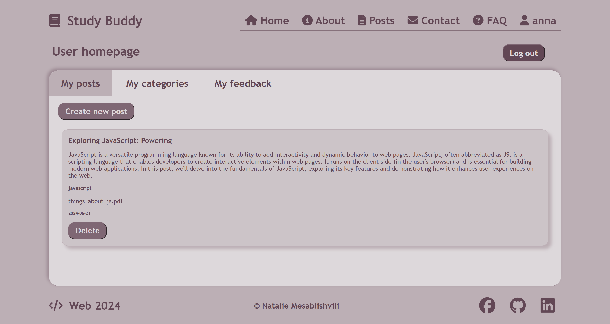
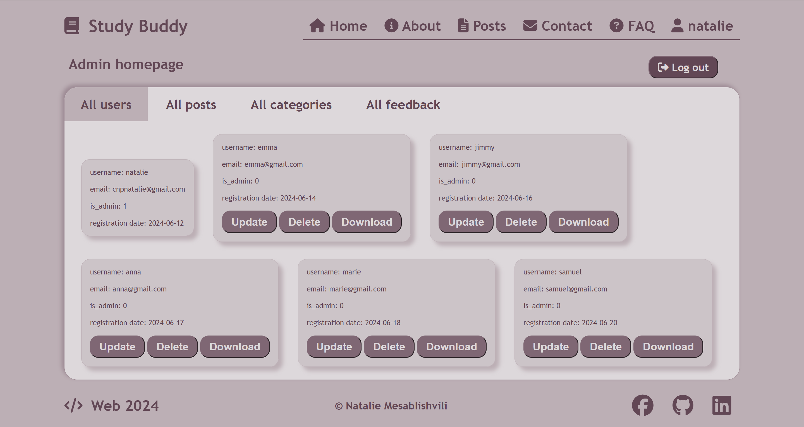
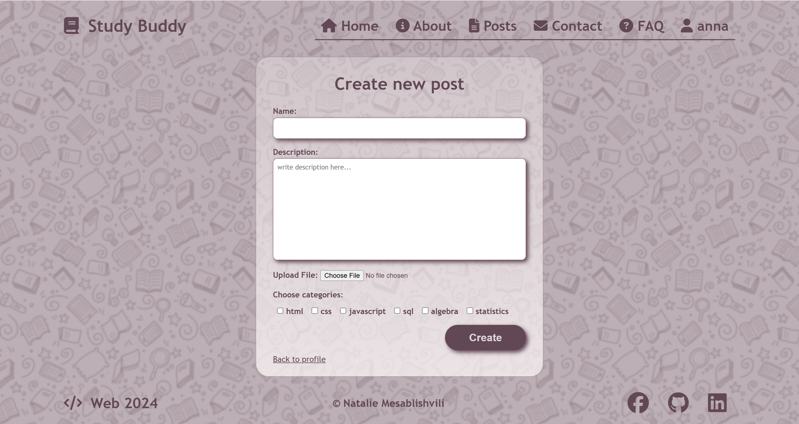

# Study Buddy - Note Sharing App for Students

A web application that allows students to share notes with each other. Users can upload notes, attach files, categorize them, and filter them for easy access.

## Features
- User registration and login with email verification
- Upload notes as text or files
- Categorize notes by subject or topic
- Responsive web interface

## Tech Stack
- PHP (backend)
- HTML, CSS, JavaScript (frontend)
- MySQL (database)

## Screenshots
- Landing Page

- Sign Up

- Log In

- About

- Frequently Asked Questions

- Contact

- User homepage

- Admin homepage

- Posts

- Creating a New Post

